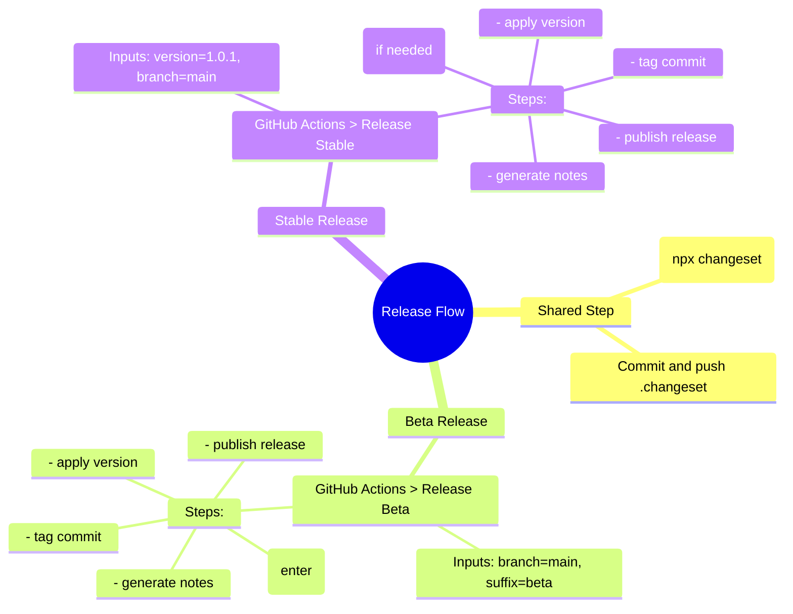

# 📆 RELEASE_PROCESS

This document outlines the official release process for the `zsh-smart-insert` plugin using [Changesets](https://github.com/changesets/changesets) and GitHub Actions workflows.

It covers both **beta (prerelease)** and **stable** release flows.

---

## ✍️ Prerequisites (For Beta and Stable)

Before triggering any release pipeline, always perform the following steps **locally**:

### 1. Create a changeset

```bash
npx changeset
```

- Select the package: `zsh-smart-insert`
- Choose the type (`patch`, `minor`, or `major`)
- Enter a changelog message in English

### 2. Commit and push the changeset

```bash
git add .changeset
git commit -m "✨ feat(release): prepare release notes"
git push
```

> ✅ This step ensures that the GitHub Actions pipeline has all the metadata needed for the release (version bump, changelog, etc.)

---

## 🚪 Beta Release

Use this process to generate versions like `1.0.1-beta.0`, `1.0.1-beta.1`, etc.

### Run the Release Beta pipeline

Go to **GitHub > Actions > Release Beta** and run it with:

- **Branch:** `main`
- **Prerelease suffix:** `beta` (or `alpha`, `rc`, etc.)

### What the Beta pipeline does

- Enters prerelease mode with the given suffix (`beta`, etc.)
- Applies version via `yarn changeset version`
- Creates version like `1.0.1-beta.0`
- Commits version bump + changelog
- Tags the commit (e.g., `v1.0.1-beta.0`)
- **Then** generates release notes (after tag)
- Pushes everything and publishes GitHub Release

### Notes on Beta Releases

If a tag like `vX.Y.Z-beta.N` already exists, the pipeline will fail.
You can delete problematic tags manually:

```bash
git push origin :refs/tags/v1.0.1-beta.0
git tag -d v1.0.1-beta.0
git fetch --prune --tags
```

---

## 🚀 Stable Release

Use this process to generate a final release version like `1.0.1`, `2.0.0`, etc.

### Run the Release Stable pipeline

Go to **GitHub > Actions > Release Stable** and run it with:

- **Version:** `1.0.1`
- **Branch:** `main`

### What the Stable pipeline does

- Automatically exits prerelease mode if applicable
- Applies the given version to `package.json`
- Runs `yarn changeset version`
- Commits bump + changelog
- Tags the commit (e.g., `v1.0.1`)
- **Then** generates release notes (after tag)
- Pushes everything and publishes GitHub Release

### Notes on Stable Releases

If the tag `vX.Y.Z` already exists, the pipeline will fail.
You can remove it manually:

```bash
git push origin :refs/tags/v1.0.1
git tag -d v1.0.1
git fetch --prune --tags
```

---

## 🧰 Release Flow Diagram (MermaidJS)



---

By following this process, your releases will be traceable, automated, and aligned with semantic versioning. 🚀
