# 📦 Release Process

This document describes the complete release flow for the `zsh-smart-insert` project, for both **beta** (prerelease) and **stable** versions, using [Changesets](https://github.com/changesets/changesets).

---

## 🧪 Beta Release

Use this process to generate versions like `1.0.1-beta.0`, `1.0.1-beta.1`, etc.

### 🔁 1. Create a Changeset

```bash
npx changeset
```

- Select the package: `zsh-smart-insert`
- Type: usually `patch` for betas
- Changelog message: **in English**

### 🚀 2. Run the Release Beta pipeline

Go to **GitHub > Actions > Release Beta** and run it with:

- Branch: `main`
- Prerelease suffix: `beta` (or `alpha`, `rc`, etc.)

### 🧠 Release Beta pipeline - What it does

- Runs `yarn changeset pre enter beta`
- Runs `yarn changeset version`
- Generates version like `1.0.1-beta.0`
- Creates changelog
- Commits and tags `v1.0.1-beta.0`
- Publishes a GitHub Release

### 🧹 Release Beta pipeline - Notes

- If the tag `vX.Y.Z-beta.N` already exists, the pipeline will fail.
- You can delete duplicate tags manually:

```bash
git push origin :refs/tags/v1.0.1-beta.0
git tag -d v1.0.1-beta.0
git fetch --prune --tags
```

---

## 🚀 Stable Release

Use this process to promote a prerelease to a final version like `1.0.1`.

### 🐚 1. Exit the prerelease cycle

```bash
yarn changeset pre exit
git add .changeset/pre.json
git commit -m "chore(changeset): 🐚 exit beta prerelease cycle"
git push origin main
```

### 📟 2. Create a new Changeset

```bash
npx changeset
```

- Type: usually `patch` to promote the beta
- Changelog message: describe the main change

### 💠 3. Run the Release Stable pipeline

Go to **GitHub > Actions > Release Stable** and run it with:

- Version: `1.0.1`
- Branch: `main`

### 🧠 Release Stable pipeline - What it does

- Runs `yarn changeset version`
- Generates a new stable version (no suffix)
- Commits `package.json`, changelog, and tag
- Creates a GitHub Release

### 🧹 Release Stable pipeline - Notes

- If the tag `vX.Y.Z` already exists, the pipeline will fail.
- You can delete it manually:

```bash
git push origin :refs/tags/v1.0.1
git tag -d v1.0.1
git fetch --prune --tags
```

---

## 🧠 Mind Map (MermaidJS)

```mermaid
mindmap
  root((Release Flow))
    Beta Release
      Create changeset (npx changeset)
      GitHub Actions > Release Beta
        Inputs: branch=main, suffix=beta
        Runs: pre enter → version → tag
      Release: vX.Y.Z-beta.N
      Notes
        Duplicate tag
        Resolve manually
    Stable Release
      Exit cycle (pre exit)
      Create new changeset
      GitHub Actions > Release Stable
        Inputs: version=1.0.1, branch=main
        Runs: version → tag
      Release: vX.Y.Z
      Notes
        Duplicate tag
```



---

With this process, your project follows a versioned, traceable, and production-safe release cycle. 💡
